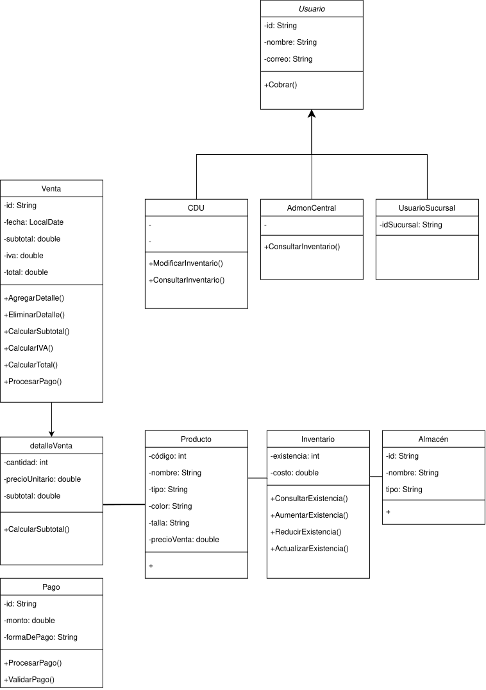

# Diagrama de clases

Diagrama de clases correspondiente al sistema **Jaguar Retail System**.

## Descripción

El diagrama representa las principales clases identificadas para el sistema y sus
relaciones, incluyendo:

- **Usuario**
- **CDU**
- **AdmonCentral**
- **UsuarioSucursal**
- **Venta**
- **DetalleVenta**
- **Producto**
- **Inventario**
- **Almacén**
- **Pago**

El modelo contempla las operaciones relacionadas con la gestión de inventario,
productos, ventas, pagos y usuarios.